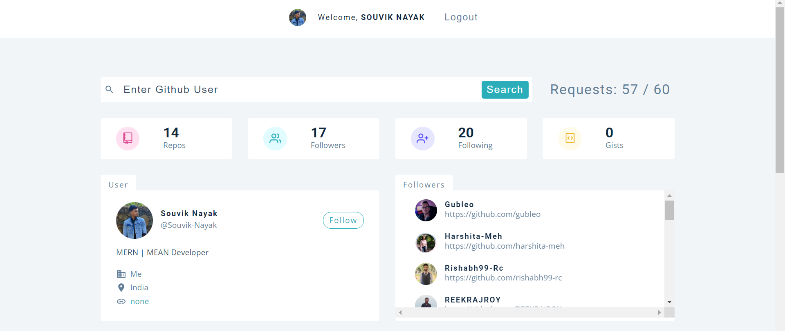

<p align="center">
    <h2 align="center">⚡️ Github Username Searcher App</h2>
</p>

## About The Project :

A simple github username searcher app using Github api based on NEXTjs and Reactjs.

## Tech Stack :

* [React](https://reactjs.org/)
* [Nextjs](https://nextjs.org//)
* [Styled Components](https://styled-components.com/)
* [Fusion Charts](https://www.fusioncharts.com/)

## Installation :

* To run the app in the development mode and Open http://localhost:3000 to view it in the browser.

    ```sh
    yarn start
    ```

* Install dependencies.

    ```sh
    yarn install
    ```
 
* Launches the test runner in the interactive watch mode.

    ```sh
    yarn test
    ```

* Builds the app for production to the build folder and It correctly bundles React in production mode. Your app is ready to be deployed !

    ```sh
    yarn build
    ```
 
 ## Screenshots :
 
 
